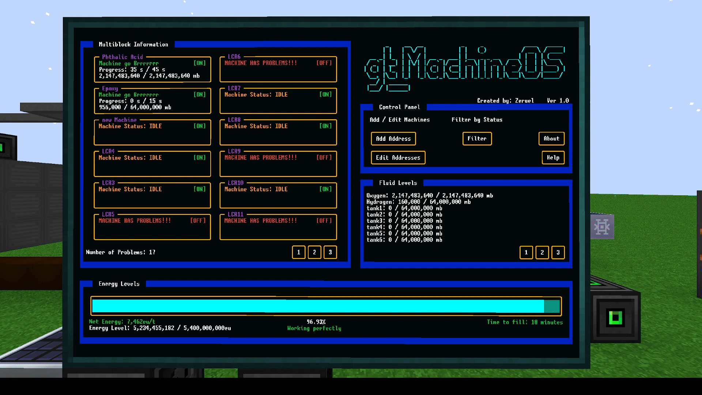
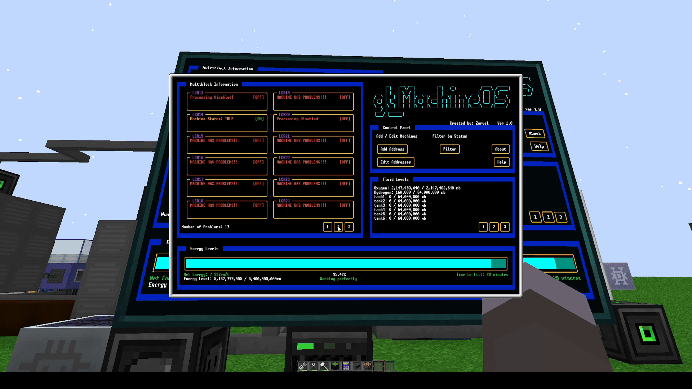

# gt_machineOS
gt_machineOS is a program for OpenComputers to be used in GT New Horizons. It's used to display information about your Multiblocks such progress, problems, and fluid levels your want to associate a tank with your Multiblock (LCR for example)

Features:
- Up to 7 pages of machines in Multiblock Information (84 total machines!)
- Up to 3 pinned machines (cleanroom recommended)
- 10 fluid tanks to monitor

Originally inspired by Sampsa's and Gordominossi's InfOS

Border code originally by Krakaen to use in 'OPENCOMPUTER AUTOMATION PROGRAM'

buttonAPI ported to OC by MoparDan originally created by DireWolf20 for ComputerCraft

## Requirements
- A tier 3 computer case or a tier 3 server
    - This is because the program requires a tier 3 graphics card
    - a server is **strongly** recommended. a tier 3 CPU can only support 16 components. With a tier 3 server, you can install up to 3 components busses to increase      capacity
- OpenOS installed on the computer
- Recommended screen size is 6x4

## Installation
 to install, type the following into your OC Computer/Server. 

```lua
wget https://raw.githubusercontent.com/Zeruel13/gt_machineOS/master/setup.lua -f
setup.lua
```

## Usage
- All machines/tanks need an adapter connected to the machine. You can do this by placing it directly beside, or placing the adapter less than 3 blocks away and use an MFU to wirelessly connect the adapter to the machine
- gtMacineList.lua can be used to easily keep track of what machines you've connected to the network vs. what machines are being used by gt_machineOS. 
    - to use gtMachineList.lua, type
    ```lua
    gtMachineList.lua > output.txt
    ```
    - this will create a text file called output.txt in the same directory as gtMachineList.lua. It will display the addresees of all gt_machines in an easy to read format 
    - Add the addresses of each machine to the files **machines.lua**, **pinnedMachines.lua**, or **tanks.lua** depending on where you want to add them. 
        - Addresses in machines.lua will be displayed under Multiblock Information
        - Addresses in tanks.lua can be used for displaying under Fluid Level or tied to a Multiblock (helpful for LCRs)
        - Adresses in pinnedMachines will be displayed under Pinned Machines
   - **Note:** as of now, any machines displayed under Fluid Levels or Pinned Machines has to be configured manually in main.lua
        - Fluid levels can be configured starting at line **338**
        - Pinned Machines can be configured starting at line **369**


## Gifs




## Disclaimer
My first code for lua. This project was originally designed as a way to learn lua. 

