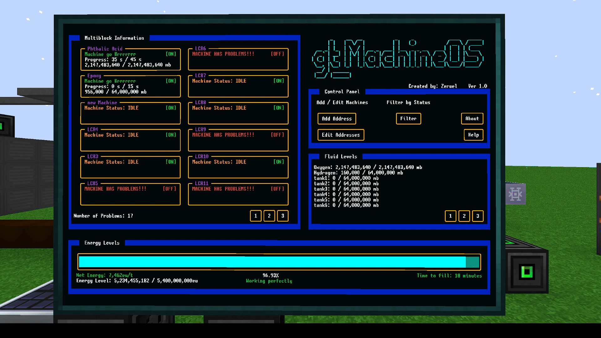
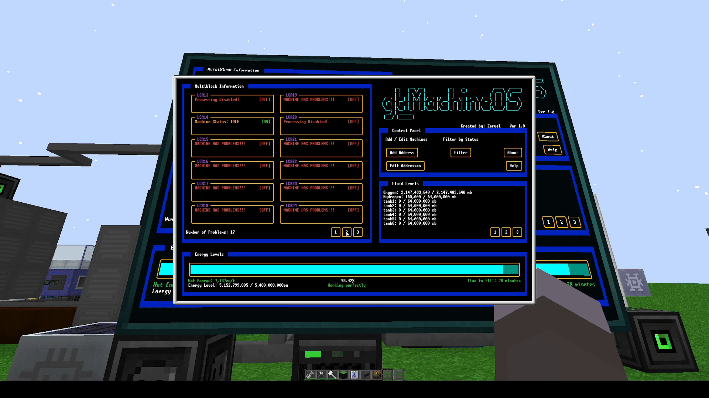

# gt_machineOS
gt_machineOS is a program for OpenComputers to be used in GT New Horizons. It's used to display information about your Multiblocks such progress, problems, and fluid levels of a tank that is associated with the multiblock (LCR for example)

Features:
- Up to 6 pages of machines in Multiblock Information (72 total machines!)
    - Display working status and any problems
    - Display progress crafting
- Up to 5 pages of tanks in Fluid Levels (50 total tanks!)
    - Display current and max fluid levels
- monitor your LSC
    - Energy bar to easily see current power
    - Average time to fill / drain that updates every 30 seconds
    - Displays net energy

Originally inspired by Sampsa's and Gordominossi's InfOS

Border code originally by Krakaen to use in 'OPENCOMPUTER AUTOMATION PROGRAM'

buttonAPI ported to OC by MoparDan originally created by DireWolf20 for ComputerCraft

## Requirements
- A tier 3 computer case or a tier 3 server
    - This is because the program requires a tier 3 graphics card
    - a server is **strongly** recommended. a tier 3 CPU can only support 16 components. With a tier 3 server, you can install up to 3 components busses to increase      capacity
- A tier 3 Screen 
    - Recommended screen size is 6x4
- A tier 3 Graphics card

- Whether you're using a computer or server, you will also need the following components:
    - Keyboard
    - Internet Card (needed to download the program)
    - Tier 3 CPU
    - Tier 1 Disk
    - Tier 1 Memory
- EEPROM (lua BIOS)
- OpenOS installed on the computer


## Installation
 to install, type the following into your OC Computer/Server. 

```lua
wget https://raw.githubusercontent.com/Zeruel13/gt_machineOS/master/setup.lua -f
setup.lua
```
Once installed, run
```main.lua```

## Usage
- All machines/tanks need an adapter connected to the machine. You can do this by placing it directly beside, or placing the adapter less than 5 blocks away and use an MFU to wirelessly connect the adapter to the machine
- Note that the program will only let you add machines if you add them one by one. 
    - Once you've added one machine, press 'Add Address' and the program will guide you. 
-Tip: Naming a tank and multiblock the same for it to appear in the multiblock section!
- Machines can also be edited using the 'Edit Addresses' button.
    - You can change the position of a machine or delete it.
- Multiblocks can be remotely turned on/off via the top-right button.
- If there's a mintanance issue with a multiblock or your LSC, gt_MachineOS will notify you.
- LSC calculates time to drain / fill every 30 seconds. 


## Gifs




## Disclaimer
My first code for lua. This project was originally designed as a way to learn lua. 

